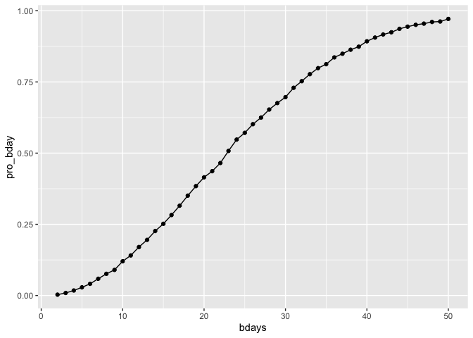
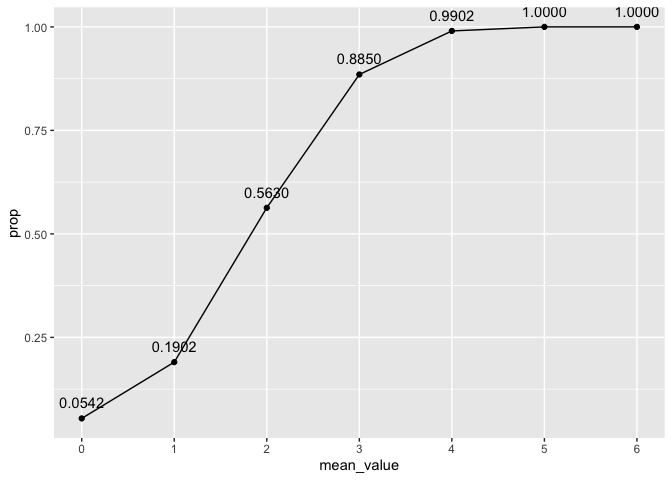
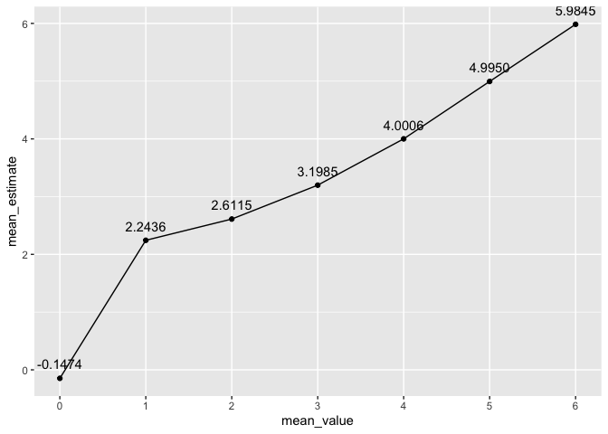
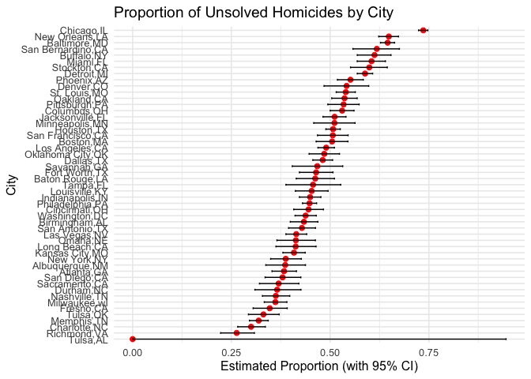

p8105_hw5_ml5363
================
Muxin Li
2025-11-09

``` r
library(tidyverse)
```

    ## ── Attaching core tidyverse packages ──────────────────────── tidyverse 2.0.0 ──
    ## ✔ dplyr     1.1.4     ✔ readr     2.1.5
    ## ✔ forcats   1.0.0     ✔ stringr   1.5.1
    ## ✔ ggplot2   3.5.2     ✔ tibble    3.3.0
    ## ✔ lubridate 1.9.4     ✔ tidyr     1.3.1
    ## ✔ purrr     1.1.0     
    ## ── Conflicts ────────────────────────────────────────── tidyverse_conflicts() ──
    ## ✖ dplyr::filter() masks stats::filter()
    ## ✖ dplyr::lag()    masks stats::lag()
    ## ℹ Use the conflicted package (<http://conflicted.r-lib.org/>) to force all conflicts to become errors

``` r
library(broom)
library(purrr)
```

## Problem 1

``` r
bdays_df=function(n_room){
  bdays=sample(1:365,n_room,replace = TRUE)
  repeat_bdays=length(unique(bdays))< n_room
  repeat_bdays
}
```

``` r
bdays_sim=
  expand_grid(
    bdays=2:50,
    iter=1:10000
  )|>
  mutate(result=map_lgl(bdays,bdays_df))|>
  group_by(bdays)|>
  summarise(
    pro_bday=mean(result)
  )
```

``` r
bdays_sim|>
  ggplot(aes(x=bdays,y=pro_bday))+
  geom_point()+
  geom_line()
```

<!-- -->
comment: The probability that at least two people share a birthday
increases rapidly as the group size grows. When the group size reaches
around 23 people, the probability exceeds 50%, meaning it is more likely
than not that two people will share a birthday. By the time the group
size reaches 50, the probability is nearly 1.

## Problem 2

``` r
sim_mean=function(mean){
  x=rnorm(30,mean,5)
  t_result=t.test(x,mu=0)
  tidy(t_result)
}
output=vector("list",5000)
for (i in 1:5000) {
  output[[i]]=sim_mean(0)
}
sim_result=bind_rows(output)
sim_result|>
  select(estimate,p.value)
```

    ## # A tibble: 5,000 × 2
    ##    estimate p.value
    ##       <dbl>   <dbl>
    ##  1  -1.08    0.245 
    ##  2  -0.0228  0.975 
    ##  3  -0.821   0.373 
    ##  4   0.507   0.602 
    ##  5  -1.20    0.201 
    ##  6   1.63    0.0653
    ##  7  -0.351   0.651 
    ##  8  -0.125   0.876 
    ##  9   0.360   0.743 
    ## 10  -0.454   0.452 
    ## # ℹ 4,990 more rows

for mean=1,2,3,4,5,6

``` r
mean_df=function(mean){
  output=vector("list",5000)
  for (i in 1:5000) {
    output[[i]]=sim_mean(mean)
  }
  sim_result=bind_rows(output)
  sim_result|>
    select(estimate,p.value)
}

mean_sim_df=function(mean){
  mean_df(mean)|>
  filter(p.value<0.05)|>
  mutate(mean_value=mean)|>
  mutate(prop=n()/5000)|>
  distinct(mean_value,prop)
}

output=vector("list",7)
for (i in 1:7) {
  output[[i]]=mean_sim_df(i-1)
}
mean_sim_result= bind_rows(output)

ggplot(mean_sim_result,aes(x=mean_value,y=prop))+
  geom_point()+
  geom_line()+
  geom_text(aes(label = sprintf("%.4f", prop), vjust = -1)) +
  scale_x_continuous(breaks = 0:6, labels = 0:6, minor_breaks = NULL)
```

<!-- -->
comment: There is a positive association between effect size (x-axis,
mean_value) and statistical power (y-axis, proportion). As the effect
size increases, the power also increases — at first gradually, then more
steeply — until it reaches close to 1.0, where it plateaus

``` r
mean_sim_df2=function(mean){
  mean_df(mean)|>
  filter(p.value<0.05)|>
  summarize(mean_value=mean, mean_estimate=mean(estimate))
}

output2=vector("list",7)
for (i in 1:7) {
  output2[[i]]=mean_sim_df2(i-1)
}
mean_sim_result2= bind_rows(output2)
ggplot(mean_sim_result2,aes(x=mean_value,y=mean_estimate))+
  geom_point()+
  geom_line()+
  geom_text(aes(label = sprintf("%.4f", mean_estimate), vjust = -1)) +
  scale_x_continuous(breaks = 0:6, labels = 0:6, minor_breaks = NULL)
```

<!-- -->
comment: Across all samples,$\hat{\mu}$ is an unbiased estimator of
$\mu$, so the average estimate is close to the true mean (as plot shows)

## Problem 3

``` r
url = "https://raw.githubusercontent.com/washingtonpost/data-homicides/refs/heads/master/homicide-data.csv"
homicides=read_csv(url)
```

    ## Rows: 52179 Columns: 12
    ## ── Column specification ────────────────────────────────────────────────────────
    ## Delimiter: ","
    ## chr (9): uid, victim_last, victim_first, victim_race, victim_age, victim_sex...
    ## dbl (3): reported_date, lat, lon
    ## 
    ## ℹ Use `spec()` to retrieve the full column specification for this data.
    ## ℹ Specify the column types or set `show_col_types = FALSE` to quiet this message.

comment: The dataset is a tibble containing 52,179 rows and 12 columns,
representing homicide records compiled by The Washington Post from
police departments across the United States.

``` r
homicides_city=
  homicides|>
  mutate(city_state=paste(city,state,sep = ","))


homicides_city|>
  drop_na(disposition)|>
  group_by(city,disposition)|>
  summarise(n=n())|>
  pivot_wider(
    names_from = disposition,
    values_from = n,
    values_fill = 0
  )|>
  mutate(total_homicides=`Closed by arrest` + `Closed without arrest` + `Open/No arrest`)|>
  mutate(unsolved_homicides=`Closed without arrest` + `Open/No arrest`)|>
  select(city,total_homicides,unsolved_homicides)
```

    ## `summarise()` has grouped output by 'city'. You can override using the
    ## `.groups` argument.

    ## # A tibble: 50 × 3
    ## # Groups:   city [50]
    ##    city        total_homicides unsolved_homicides
    ##    <chr>                 <int>              <int>
    ##  1 Albuquerque             378                146
    ##  2 Atlanta                 973                373
    ##  3 Baltimore              2827               1825
    ##  4 Baton Rouge             424                196
    ##  5 Birmingham              800                347
    ##  6 Boston                  614                310
    ##  7 Buffalo                 521                319
    ##  8 Charlotte               687                206
    ##  9 Chicago                5535               4073
    ## 10 Cincinnati              694                309
    ## # ℹ 40 more rows

``` r
homicides_city|>
  drop_na(disposition)|>
  filter(city_state=="Baltimore,MD")|>
  group_by(city_state,disposition)|>
  summarise(n=n())|>
  pivot_wider(
    names_from = disposition,
    values_from = n
  )|>
  mutate(total_homicides=`Closed by arrest` + `Closed without arrest` + `Open/No arrest`)|>
  mutate(unsolved_homicides=`Closed without arrest` + `Open/No arrest`)|>
  mutate(prop=unsolved_homicides/total_homicides)
```

    ## `summarise()` has grouped output by 'city_state'. You can override using the
    ## `.groups` argument.

    ## # A tibble: 1 × 7
    ## # Groups:   city_state [1]
    ##   city_state   `Closed by arrest` `Closed without arrest` `Open/No arrest`
    ##   <chr>                     <int>                   <int>            <int>
    ## 1 Baltimore,MD               1002                     152             1673
    ## # ℹ 3 more variables: total_homicides <int>, unsolved_homicides <int>,
    ## #   prop <dbl>

``` r
Baltimore_MD =prop.test(1825,2827)

prop.test(1825,2827)|>
  tidy()|>
  select(estimate,conf.low, conf.high )
```

    ## # A tibble: 1 × 3
    ##   estimate conf.low conf.high
    ##      <dbl>    <dbl>     <dbl>
    ## 1    0.646    0.628     0.663

``` r
source("prop_test.R")
new=prop_test("Baltimore,MD")


city_name_homicides=
  homicides_city|>
  distinct(city_state)


prop_test_all=
  expand_grid(
  city_name_homicides,
)|>
  mutate(
    city_prop=map(city_state,prop_test)
  )|>
  unnest(city_prop)
```

    ## Warning: There was 1 warning in `mutate()`.
    ## ℹ In argument: `city_prop = map(city_state, prop_test)`.
    ## Caused by warning in `prop.test()`:
    ## ! Chi-squared approximation may be incorrect

``` r
prop_test_all=select(prop_test_all,city_state, prop, estimate,conf.low, conf.high)
```

``` r
prop_test_all=
  prop_test_all|>
  arrange(prop)|>
  mutate(city_state = factor(city_state, levels = city_state))

ggplot(prop_test_all, aes(x = city_state, y = estimate)) +
  geom_point(color = "red", size = 2) +  
  geom_errorbar(aes(ymin = conf.low, ymax = conf.high), width = 0.3) +
                              
  labs(
    title = "Proportion of Unsolved Homicides by City",
    x = "City",
    y = "Estimated Proportion (with 95% CI)"
  ) +
  theme_minimal(base_size = 12)
```

<!-- -->
